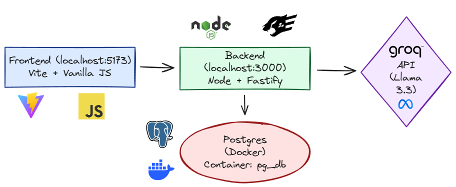
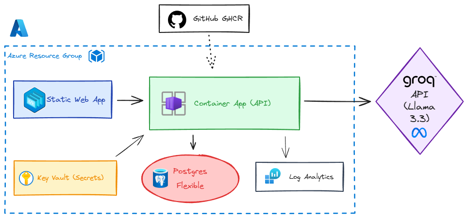
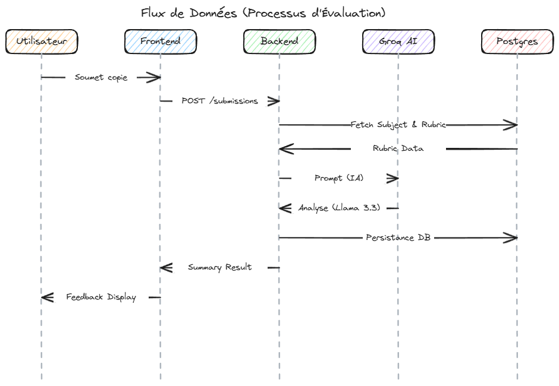

# 🐧 GradeScale (PoC) : Core Grading Engine pour l'Éducation Assistée par IA

> **Technical Sandbox & Architectural Concept**
> Ce dépôt présente une preuve de concept (PoC) se concentrant sur le moteur d'évaluation backend. Il explore l'implémentation de modèles de données et structurels permettant à l'IA d'assister les enseignants dans l'analyse granulaire des apprentissages, avec un focus sur la robustesse et la scalabilité.

---

## 🎯 1. Contexte Ingénierie & Métier

La conception de ce PoC répond à un double objectif :
1. **Transposition Architecturale** : Démontrer ma capacité à projeter des compétences éprouvées en ingénierie de la donnée (Python / SQL / Data Stack moderne) sur une stack Transactionnelle et Cloud-Native cible (Node.js, TypeScript, PostgreSQL).
2. **Domain-Driven Design (DDD)** : Intégrer une expertise métier profonde (15 ans d'enseignement de la Physique-Chimie) directement dans la structure de données et la logique métier, assurant que la technologie serve des cas d'usage pédagogiques concrets.

## 🏗️ 2. Décisions d'Architecture (System Design)

Le système est construit sur des principes applicatifs robustes, conçus pour la maintenabilité et la sécurité :

*   **Validation Gérée par le Schéma (Type Safety)** : Utilisation exclusive de **Zod** à la frontière de l'API pour parser les payload entrants et contraindre les réponses du LLM (Structured Outputs), garantissant un typage strict end-to-end.
*   **Couche de Service Isolée (Separation of Concerns)** : La logique analytique et l'orchestration de l'IA (remplissage des barèmes, appels API) sont découplées des routeurs Fastify, facilitant les tests unitaires et l'isolation du code.
*   **Infrastructure Managée (Azure PostgreSQL)** : Migration d'une architecture Neon vers un environnement Azure PostgreSQL Flexible Server, assurant une isolation complète des données et une gestion robuste des backups.
*   **Privacy By Design (RGPD)** : Intégration d'une couche de pseudonymisation interceptant et nettoyant les données étudiantes brutes avant leur exposition systémique à un fournisseur LLM externe.

## 🔭 3. Modélisation Pédagogique (Core Domain)

Le schéma relationnel modélise une évaluation formative granulée, au-delà du simple "score" :
*   **Rubriques et Critères** : Structuration hiérarchique dynamique pour évaluer les compétences conceptuelles transverses (Ex: Démarche d'investigation, validation des unités).
*   **Détection des *Misconceptions*** : Le moteur d'analyse sémantique est architecturé pour identifier les biais de raisonnement récurrents chez l'élève, facilitant la génération de feedbacks actionnables.

## 🛠️ 4. Stack Technique & Industrialisation

Le projet est conçu avec une double approche : **Simplicité locale** et **Scalabilité industrielle**.

*   **Logic (Local)** : Node.js, TypeScript, Fastify, Prisma, PostgreSQL.
*   **Industrial (Cloud)** : Docker (Multi-stage), Terraform (IaC), Azure Container Apps, Azure Static Web Apps, Vitest (QA).
*   **Automation (CI/CD)** : GitHub Actions (Pipeline complet de test et déploiement).
*   **Intelligence** : Inférence Groq LPU (Modèles Llama 3.3 70B).

---

## 🚀 Mode 1 : Développement Local (Fast Dev)

C'est la méthode recommandée pour tester le moteur d'évaluation ou contribuer au code rapidement.

### 1. Prérequis
*   **Node.js (LTS)** & **Docker** (pour le Postgres local).
*   **Groq API Key** (Gratuit sur [console.groq.com](https://console.groq.com/)).

### 2. Configuration & Lancement
1. **Installation** :
   ```bash
   npm ci && cd frontend && npm ci && cd ..
   ```
2. **Environnement** :
   `cp .env.example .env` (Renseignez votre `GROQ_API_KEY`).
3. **Base de données** :
   ```bash
   docker-compose up -d
   npx prisma migrate dev && npm run seed
   ```
4. **Run** :
   *   Backend : `npm run dev` (Port 3000)
   *   Frontend : `cd frontend && npm run dev` (Port 5173)



---

## ☁️ Mode 2 : Déploiement Cloud (Azure Industrial)

### 0. Prérequis & Configuration `.env`
Avant de déployer, assurez-vous d'avoir les éléments suivants dans votre fichier `.env` à la racine :

*   **Azure CLI** & **Terraform** (>= 1.5.0) installés.
*   **`AZURE_DB_PASSWORD`** : Définissez ici le mot de passe que vous souhaitez attribuer à l'instance PostgreSQL managée sur Azure (Terraform l'utilisera pour la création).
*   **`GITHUB_PAT`** : Un *Personal Access Token* GitHub (scopes `write:packages`, `read:packages`, **`repo`**). Le scope `repo` est indispensable pour que Terraform puisse automatiser l'injection du token SWA dans vos secrets GitHub Actions.
*   **`GROQ_API_KEY`** : Votre clé pour l'inférence IA.

### 1. Initialisation du Remote State
Pour stocker l'état de l'infrastructure de manière sécurisée et partagée :
```bash
chmod +x infra/backend_setup/init_backend.sh
./infra/backend_setup/init_backend.sh
```

### 🚀 Déploiement Rapide (Quick Start)

### 1️⃣ Configuration Initiale
1. Clonez le repository.
2. Créez votre fichier `.env` à partir du `.env.example`.
3. Configurez vos variables (Groq API Key, GitHub PAT, etc.).

### 2️⃣ Publication de l'Image Docker
> [!IMPORTANT]
> Cette étape doit être effectuée **avant** le déploiement de l'infrastructure pour éviter les erreurs de démarrage des conteneurs.

```bash
# Login sur GitHub Container Registry
export GITHUB_PAT=votre_pat
echo $GITHUB_PAT | docker login ghcr.io -u votre_username --password-stdin

# Build et Push de l'image API
make api-push
```

### 3️⃣ Déploiement de l'Infrastructure (IaC)
L'infrastructure utilise Terraform pour provisionner les services Azure (Postgres, Container Apps, Static Web Apps).

```bash
# Initialisation
make infra-init-dev

# Injection du token GH pour l'automatisation des secrets (Senior Style)
export TF_VAR_github_pat=$(gh auth token)

# Déploiement
make infra-apply-dev
```
*Note : Grâce au provider GitHub, Terraform injectera automatiquement le jeton `AZURE_SWA_TOKEN` dans votre repo GitHub.*

### 4️⃣ Finalisation du Déploiement
Une fois l'infrastructure prête, déployez le frontend et initialisez la base de données :
1.  **Backend** (Container Apps) :
    ```bash
    make api-rollout-dev # Déclenche le rollout sur Azure
    ```
2.  **Frontend** (Static Web Apps) :
    ```bash
    make front-push-dev  # Build et déploiement via Azure SWA CLI
    ```

### 🔐 Sécurité & Secrets (Key Vault)
Le projet applique les meilleures pratiques de sécurité Cloud-Native :
*   **Zero Secret Leak** : Votre `GROQ_API_KEY` et la `DATABASE_URL` sont injectées automatiquement dans **Azure Key Vault** lors du déploiement Terraform.
*   **Managed Identity** : Le Backend accède au Vault via une identité managée, éliminant le besoin de stocker des credentials dans le code ou les variables d'environnement.

### 🤖 CI/CD Automatisé (GitHub Actions)
Le pipeline `.github/workflows/deploy.yml` prend le relais après le premier déploiement :
1.  **Validation** : Tests Vitest complets (Backend/Frontend).
2.  **Continuous Deployment** : À chaque `push` on `master`, GitHub automatise le cycle Build -> Push -> Rollout -> Smoke Test.

---

## 🛠️ Commandes Universelles (Makefile)

Le `Makefile` est le point d'entrée unique pour toutes les opérations :
*   `make test` : Suite complète de tests unitaires et d'intégration.
*   `make nuke` : **Destruction propre** (Terraform destroy + nettoyage local).
*   `make db-migrate-dev` : Applique les migrations Prisma sur la base Cloud.
*   `make db-reset-dev` : Réinitialise et re-seed la base Azure Dev.

---

## 🏗️ Architecture System Design (Azure Cloud)

Le système est conçu pour être **Scalable**, **Sécurisé** et **Observale**.

### Schéma d'Architecture Cible


### Composants Clés & Rôles
1.  **Azure Static Web Apps (SWA)** : Hébergement optimisé du frontend, avec certificat SSL et CDN intégrés.
2.  **Azure Container Apps (ACA)** : Orchestration serverless de l'API Node.js. Gère le scaling et les révisions de déploiement (Blue/Green possible).
3.  **Managed Identity (MSI)** : Sécurité "Zero Secret" — le backend s'authentifie au Key Vault sans mot de passe.
4.  **Azure Key Vault** : Coffre-fort numérique centralisant les clés d'API (Groq) et les chaînes de connexion.
5.  **PostgreSQL Flexible Server** : Base de données managée garantissant la persistance et l'intégrité des données pédagogiques.
6.  **Log Analytics Workspace** : Centralisation des logs pour le monitoring en temps réel et le debugging.

### Flux de Données (Processus d'Évaluation)
1.  **Soumission** : L'utilisateur envoie une copie d'élève via le Frontend.
2.  **Orchestration** : L'ACA reçoit la requête, valide le schéma (Zod) et récupère les secrets dans le Key Vault via MSI.
3.  **Intelligence** : L'ACA envoie la copie et le barème à **Groq** pour une analyse sémantique ultra-rapide.
4.  **Persistance** : Le résultat (note, critères, méconceptions) est stocké dans **PostgreSQL** via Prisma.
5.  **Retour** : Le frontend affiche le feedback pédagogique détaillé.



---

## 🌐 Déploiement & Live Demo

Le projet est désormais industrialisé sur Azure :
*   **🚀 Interface Frontend** : [https://grade-scale.azurestaticapps.net/](https://grade-scale.azurestaticapps.net/)
*   **⚙️ API Backend** : [https://aca-gradescale-api.azurecontainerapps.io/](https://aca-gradescale-api.azurecontainerapps.io/)

> [!NOTE]
> Les déploiements sont entièrement automatisés. Chaque `push` sur la branche `master` déclenche une mise à jour transparente de l'application après validation des tests.

---

## 📋 Roadmap
- [x] **Infrastructure** : 100% IaC avec Terraform sur Azure.
- [x] **CI/CD** : Pipeline GitHub Actions (Test/Build/Deploy/Smoke).
- [x] **Backend** : Migration de Render vers Azure Container Apps.
- [x] **Database** : Migration de Neon vers Azure Postgres Flexible.
- [x] **Frontend** : Migration de Vercel vers Azure Static Web Apps.
- [ ] **Observabilité** : Dashboards Grafana/Azure Monitor avancés.
- [ ] **Pédagogie** : Support Vision pour l'OCR des copies manuscrites.

## 🛠️ Dépannage (Troubleshooting)

### Erreur `409 Conflict (ContainerAppOperationInProgress)`
**Cause** : Une opération précédente sur l'Azure Container App est encore en cours de traitement par Azure.
**Solution** : Attendez 2-3 minutes que l'opération se termine côté Azure, puis relancez `make infra-apply-dev`.

### Erreur `resource already exists` (Prisma ou Terraform)
**Cause** : Une interruption du processus a laissé des ressources créées mais non enregistrées dans le fichier d'état (`state`).
**Solution (Terraform)** : Utilisez `terraform import` pour rattacher la ressource existante à votre state (voir les logs Terraform pour l'ID de la ressource).

---
*Projet conçu avec rigueur par Michael GARCIA - Ingénieur & Enseignant.*