# Architecture & Communication Backend/Frontend

Ce document détaille le fonctionnement interne du backend et la manière dont le frontend communique avec lui.

## 1. Le Backend (API Fastify)

Le backend repose sur **Fastify**, un framework Node.js reconnu pour ses performances (plus rapide qu'Express).

### Points clés du Backend :
1. **Validation stricte avec Zod** : Utilisation de `fastify-type-provider-zod`. Toutes les données entrantes (ex: `CreateSubmissionSchema`) sont validées avant même de toucher la logique métier. En cas de données invalides, Fastify renvoie automatiquement une erreur 400.
2. **Gestionnaire d'erreurs centralisé (Error Handler)** : Toutes les erreurs (Zod, métier `AppError`, ou imprévues) passent par le bloc `server.setErrorHandler`. C'est une excellente pratique pour garantir que l'API renvoie toujours un JSON structuré et n'expose jamais de traces techniques aux utilisateurs.
3. **L'ORM Prisma** : La base de données est gérée via Prisma, permettant des requêtes fortement typées (`prisma.submission.create`, `prisma.evaluation.findUnique`) avec leurs relations (critères, rubriques).
4. **Le traitement Asynchrone (Background Task)** : C'est le point clé de la route `POST /submissions`.
    - Sauvegarde de la copie en base de données.
    - Lancement de `evaluationService.evaluateSubmission()` **sans utiliser `await`**.
    - L'API retourne immédiatement un code HTTP `202 Accepted` au client.
    - *Pourquoi ?* Car l'appel au LLM (Groq/OpenAI) peut prendre de 10 à 30 secondes. Attendre la fin risquerait de déclencher un timeout HTTP classique (souvent 15 à 30 secondes).

## 2. La communication Frontend -> Backend

Côté frontend, les requêtes sont effectuées avec l'API native `fetch` (Vanilla JS). Le processus de communication pour l'évaluation suit le pattern **Polling** (sondage régulier).

### Le cycle de vie d'une soumission :
1. **POST de la soumission** : L'utilisateur clique sur "Soumettre". Le front envoie la copie à `POST /submissions`.
2. **Réception de l'ID** : Le back répond immédiatement `202 Accepted` en fournissant un `submissionId`.
3. **Polling (Sondage)** : Le frontend lance la fonction `pollResult(submissionId)`. Toutes les 2 secondes, il effectue une requête `GET /evaluations/:submissionId`.
    - Si le statut n'est pas encore complété, l'API répond avec une erreur `404 Not Found` (l'évaluation n'existe pas encore complètement).
    - Si l'évaluation est terminée (`COMPLETED`), l'API renvoie le JSON complet avec les notes et le feedback.
4. **Affichage** : Le polling s'arrête (`clearInterval`), et l'interface utilisateur (DOM) est mise à jour dynamiquement.

---

## 3. Diagramme de Séquence

Voici un diagramme de séquence illustrant la communication asynchrone entre l'UI, l'API et le LLM.

```mermaid
%%{init: {
  'theme': 'base',
  'themeVariables': {
    'darkMode': true,
    'primaryColor': '#2d2e34',
    'primaryTextColor': '#ffffff',
    'primaryBorderColor': '#58a6ff',
    'lineColor': '#8b949e',
    'secondaryColor': '#161b22',
    'tertiaryColor': '#1f2428',
    'noteBkgColor': '#30363d',
    'noteTextColor': '#e6edf3',
    'sequenceNumberColor': '#ffffff'
  }
}}%%
sequenceDiagram
    autonumber
    actor User as Utilisateur
    participant Browser as Frontend (Vanilla JS)
    participant API as Backend API (Fastify)
    participant DB as Base de Données (PostgreSQL)
    participant LLM as Service IA (Groq/OpenAI)

    User->>Browser: Rédige sa copie et clique sur "Soumettre"
    Browser->>API: POST /submissions { content, questionId }
    
    %% Boîte Bleue Foncée pour le Synchrone
    rect rgb(30, 45, 65)
        Note right of API: Traitement Synchrone (Rapide)
        API->>DB: Sauvegarde la soumission
        DB-->>API: Retourne submissionId
        API-->>Browser: 202 Accepted { submissionId }
    end
    
    Browser->>Browser: Affiche le loader d'attente
    
    %% Boîte Orange Foncée/Ambre pour l'Asynchrone
    rect rgb(60, 45, 30)
        Note right of API: Traitement Asynchrone (En tâche de fond)
        API-xLLM: Envoi du prompt (Background Job)
    end

    loop Polling (Toutes les 2 secondes)
        Browser->>API: GET /evaluations/{submissionId}
        API->>DB: Recherche de l'évaluation
        alt Evaluation non terminée
            DB-->>API: Not Found
            API-->>Browser: 404 (Continue d'attendre)
        end
    end

    Note right of LLM: Quelques secondes plus tard...
    LLM-->>API: Retourne la correction (JSON)
    API->>DB: Sauvegarde l'évaluation complète

    Browser->>API: GET /evaluations/{submissionId} (Polling suivant)
    API->>DB: Recherche de l'évaluation
    DB-->>API: Données d'évaluation { status: COMPLETED, scores... }
    API-->>API: (Logique métier)
    API-->>Browser: 200 OK (JSON complet de la correction)
    
    Browser->>Browser: Arrête le polling (clearInterval)
    Browser->>User: Affiche les résultats, notes et feedbacks
```

